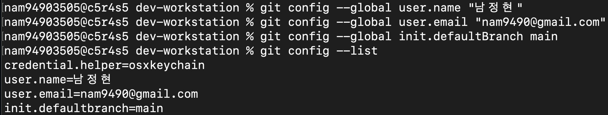

## 9. Git 설정 및 GitHub 연동

[← README로 돌아가기](../README.md)

```
nam94903505@c5r4s5 dev-workstation % git config --global user.name "남정현"
nam94903505@c5r4s5 dev-workstation % git config --global user.email "nam9490@gmail.com"
nam94903505@c5r4s5 dev-workstation % git config --global init.defaultBranch main
nam94903505@c5r4s5 dev-workstation % git config --list
credential.helper=osxkeychain
user.name=남정현
user.email=nam9490@gmail.com
init.defaultbranch=main
```

VSCode GitHub 연동 증거:


