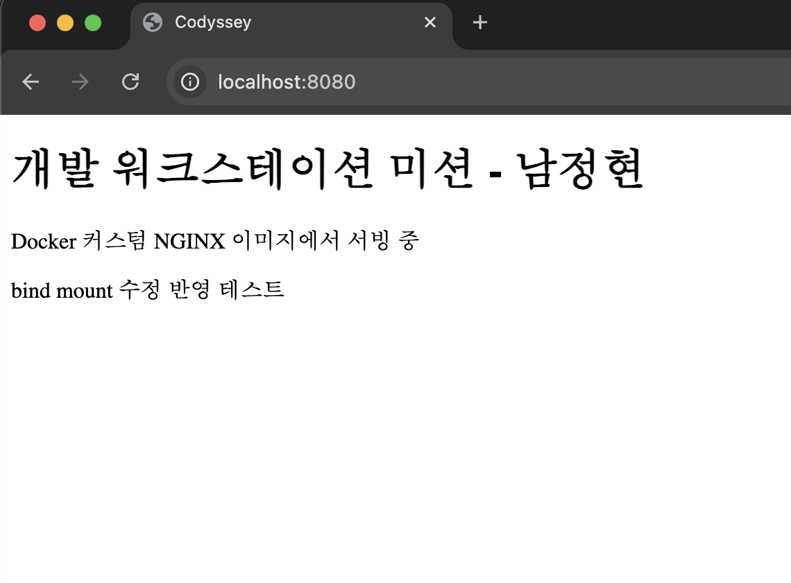
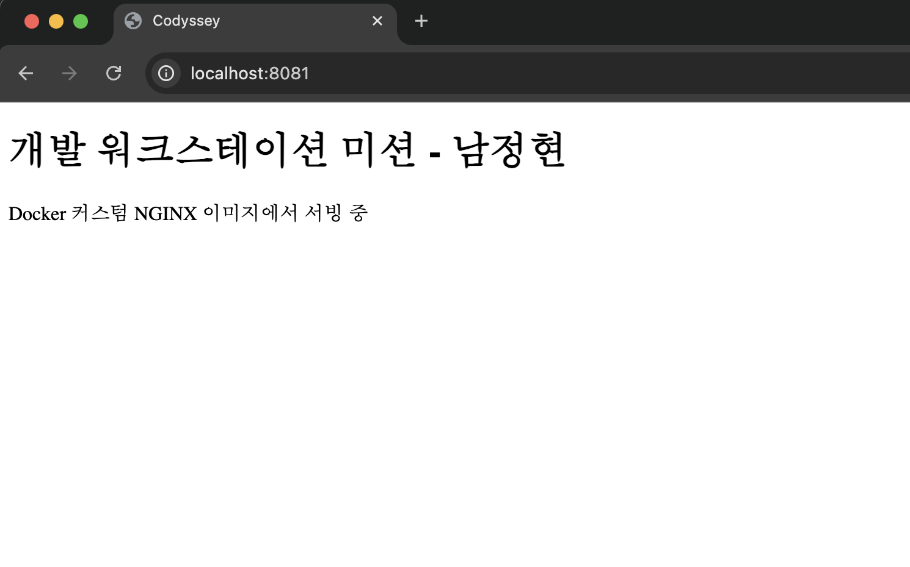

## 5. 커스텀 이미지 빌드 (Dockerfile)

[← README로 돌아가기](../README.md)

선택한 베이스: `nginx:alpine` (방식 A — 웹 서버 베이스 + 정적 콘텐츠 교체)

커스텀 포인트와 목적:

| 항목 | 목적 |
|---|---|
| `FROM nginx:alpine` | 검증된 경량 웹 서버를 베이스로 재사용해 설치 과정 없이 서빙 환경 확보 |
| `LABEL` | 이미지 제목·관리자 메타데이터를 남겨 이미지 식별성 확보 |
| `ENV APP_ENV=dev` | 실행 환경 설정을 코드와 분리해 환경 변수로 주입 |
| `COPY app/ ...` | NGINX 기본 페이지를 직접 작성한 정적 콘텐츠로 교체 |
| `HEALTHCHECK` | 컨테이너가 실제로 응답 가능한 상태인지 주기적으로 자동 점검 |

### Dockerfile

```dockerfile

FROM nginx:alpine

LABEL org.opencontainers.image.title="my-custom-nginx"

LABEL maintainer="njh0820@dongyang.ac.kr"

ENV APP_ENV=dev

COPY app/ /usr/share/nginx/html/

HEALTHCHECK --interval=30s CMD wget -q -O /dev/null http://localhost || exit 1

EXPOSE 80

```

빌드/실행:

```bash
nam94903505@c5r4s5 dev-workstation % docker build -t my-web:1.0 .
[+] Building 6.8s (7/7) FINISHED                                                        docker:orbstack
 => [internal] load build definition from Dockerfile                                               0.2s
 => => transferring dockerfile: 292B                                                               0.0s
 => [internal] load metadata for docker.io/library/nginx:alpine                                    2.5s
 => [internal] load .dockerignore                                                                  0.2s
 => => transferring context: 2B                                                                    0.0s
 => [internal] load build context                                                                  0.2s
 => => transferring context: 389B                                                                  0.0s
 => [1/2] FROM docker.io/library/nginx:alpine@sha256:4a73073bd557c65b759505da037898b61f1be6cbcc3c  3.1s
 => => resolve docker.io/library/nginx:alpine@sha256:4a73073bd557c65b759505da037898b61f1be6cbcc3c  0.2s
 => => sha256:4a73073bd557c65b759505da037898b61f1be6cbcc3c2c3aeac22d2a470c1752 10.33kB / 10.33kB   0.0s
 => => sha256:1d40e3eb3bf4f138de1d67193f2aa5309fcaf343eb5ffadbf5e9439de1eb1ebb 2.50kB / 2.50kB     0.0s
 => => sha256:f0ba77f796e57c6fa89ae7f4fdad1665d6fcbd8e3f211535120542b337f9959e 12.32kB / 12.32kB   0.0s
 => => sha256:1223f016b4e4a2c21f7c49d4837fbfd47a9da6436b511690ca1e582fc2810d59 627B / 627B         0.5s
 => => sha256:62bec68d7c31c4c8a19d812d84da5f7748e54690c037979945b6c5b6c924b142 957B / 957B         0.7s
 => => sha256:3cd534fe98c64d68a1f4f1c83abb8d5cba7ecfd7be88e592389929d12e6253da 1.89MB / 1.89MB     0.3s
 => => extracting sha256:3cd534fe98c64d68a1f4f1c83abb8d5cba7ecfd7be88e592389929d12e6253da          0.1s
 => => sha256:46f977ee452f4399c208714afa034868d6056864f8a0cf3c643ab143dd802c80 404B / 404B         0.7s
 => => sha256:d0008c891db48b5f526d914bce9e8d889fe1a9d1f08291ae03fe97f871726f38 1.21kB / 1.21kB     0.8s
 => => extracting sha256:1223f016b4e4a2c21f7c49d4837fbfd47a9da6436b511690ca1e582fc2810d59          0.0s
 => => extracting sha256:62bec68d7c31c4c8a19d812d84da5f7748e54690c037979945b6c5b6c924b142          0.0s
 => => sha256:390dc935348d8070e695fbaae2a4bb114fb9e69c59f628e7576036ee9d5244c9 1.40kB / 1.40kB     1.0s
 => => extracting sha256:46f977ee452f4399c208714afa034868d6056864f8a0cf3c643ab143dd802c80          0.0s
 => => sha256:46519e7231d2eb5604df229beb44d59719a489eaa7aca52982535a010b07a9ed 20.31MB / 20.31MB   1.5s
 => => extracting sha256:d0008c891db48b5f526d914bce9e8d889fe1a9d1f08291ae03fe97f871726f38          0.0s
 => => extracting sha256:390dc935348d8070e695fbaae2a4bb114fb9e69c59f628e7576036ee9d5244c9          0.0s
 => => extracting sha256:46519e7231d2eb5604df229beb44d59719a489eaa7aca52982535a010b07a9ed          0.4s
 => [2/2] COPY app/ /usr/share/nginx/html/                                                         0.2s
 => exporting to image                                                                             0.2s
 => => exporting layers                                                                            0.1s
 => => writing image sha256:1729ef88194a2b5cc9eb7898fa6b370d4dd29322401bc5f931e08467b399e780       0.0s
 => => naming to docker.io/library/my-web:1.0
```

```bash
nam94903505@c5r4s5 dev-workstation % docker images 
REPOSITORY    TAG       IMAGE ID       CREATED          SIZE
my-web        1.0       1729ef88194a   15 seconds ago   62.4MB
ubuntu        latest    de7345b16e94   2 weeks ago      100MB
bash          latest    bc60f054756d   6 weeks ago      15.6MB
hello-world   latest    e2ac70e7319a   4 months ago     10.1kB
```

## 6. 포트 매핑

```bash
nam94903505@c5r4s5 dev-workstation % docker run -d -p 8080:80 --name web-8080 my-web:1.0
docker run -d -p 8081:80 --name web-8081 my-web:1.0
docker ps
90bcc474d1b089e8f2b1708c49853b3047d4741e1c0349ab76495a195c00bb54
00d147e009f43ec5e84a56cd3b519cb23eb65097f2a029ec087b008c13d64b07
CONTAINER ID   IMAGE        COMMAND                  CREATED        STATUS                                     PORTS                                     NAMES
00d147e009f4   my-web:1.0   "/docker-entrypoint.…"   1 second ago   Up Less than a second (health: starting)   0.0.0.0:8081->80/tcp, [::]:8081->80/tcp   web-8081
90bcc474d1b0   my-web:1.0   "/docker-entrypoint.…"   1 second ago   Up Less than a second (health: starting)   0.0.0.0:8080->80/tcp, [::]:8080->80/tcp   web-8080
```

브라우저 접속 증거 (주소창 포함):




포트 매핑이 필요한 이유:

컨테이너는 호스트와 격리된 자체 네트워크 공간을 가지므로, 컨테이너 내부의 80 포트는 기본적으로 호스트에서 접근할 수 없다. -p <호스트포트>:<컨테이너포트>로 두 포트를 연결해야 외부에서 접속이 가능하다. 같은 이미지를 8080, 8081 두 포트로 동시에 실행해도 충돌 없이 각각 접속되는 것으로 격리와 재현성을 확인했다.

## 7. 바인드 마운트

```bash
nam94903505@c5r4s5 dev-workstation % docker rm -f web-8080
docker run -d -p 8080:80 --name web-bind \
  -v "$(pwd)/app:/usr/share/nginx/html" my-web:1.0
web-8080
d51a0e0bbd49c90fb2666c4de67edb6edd48752c655f98fc546edb397b99e7c4
nam94903505@c5r4s5 dev-workstation % curl http://localhost:8080
<!DOCTYPE html>
<html lang="kr">
<head>
    <meta charset="UTF-8">
    <meta name="viewport" content="width=device-width, initial-scale=1.0">
    <title>Codyssey</title>
</head>
<body>
    <h1>개발 워크스테이션 미션 - 남정현</h1>
    <p>Docker 커스텀 NGINX 이미지에서 서빙 중</p>
</body>
</html>%                                                                                                nam94903505@c5r4s5 dev-workstation % echo "<p>bind mount 수정 반영 테스트</p>" >> app/index.html
nam94903505@c5r4s5 dev-workstation % curl http://localhost:8080
<!DOCTYPE html>
<html lang="kr">
<head>
    <meta charset="UTF-8">
    <meta name="viewport" content="width=device-width, initial-scale=1.0">
    <title>Codyssey</title>
</head>
<body>
    <h1>개발 워크스테이션 미션 - 남정현</h1>
    <p>Docker 커스텀 NGINX 이미지에서 서빙 중</p>
</body>
</html><p>bind mount 수정 반영 테스트</p>
```

## 8. Docker 볼륨 영속성

```bash
nam94903505@c5r4s5 dev-workstation % docker volume create mydata
mydata
nam94903505@c5r4s5 dev-workstation % docker volume ls
DRIVER    VOLUME NAME
local     mydata
nam94903505@c5r4s5 dev-workstation % docker run -d --name vol-test -v mydata:/data ubuntu sleep infinity 

bba26d65e01e6a54a64342f0baa696f4f263996548f564da66d038d7acf5c7d1
nam94903505@c5r4s5 dev-workstation % docker exec vol-test bash -c "echo persist-test > /data/hello.txt && cat /data/hello.txt"
persist-test
nam94903505@c5r4s5 dev-workstation % docker rm -f vol-test
vol-test
nam94903505@c5r4s5 dev-workstation % docker ps -a | grep vol-test
nam94903505@c5r4s5 dev-workstation % docker run -d --name vol-test2 -v mydata:/data ubuntu sleep infinity
b5654eca24d7fa8b23d60022ec76ecaf4c801f03e5cfb0988209f553240e241c
nam94903505@c5r4s5 dev-workstation % docker exec vol-test2 cat /data/hello.txt
persist-test
nam94903505@c5r4s5 dev-workstation % docker rm -f vol-test2
vol-test2
```

검증 결과:

컨테이너의 쓰기 레이어는 컨테이너 삭제와 함께 사라지지만, 볼륨은 Docker가 컨테이너와 독립적으로 관리하는 저장 공간이므로 데이터가 유지된다. 실제로 컨테이너를 삭제하고 새 컨테이너에 같은 볼륨을 연결했을 때 이전에 기록한 파일이 그대로 남아 있음을 확인했다.
