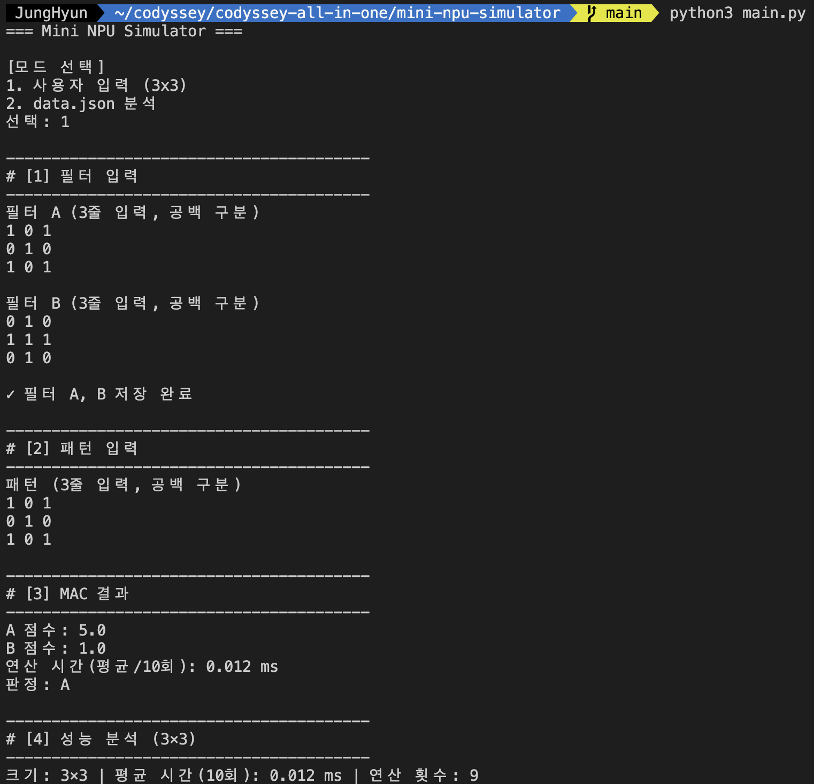
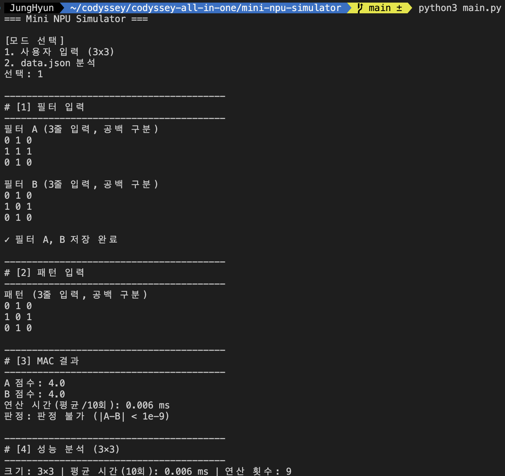
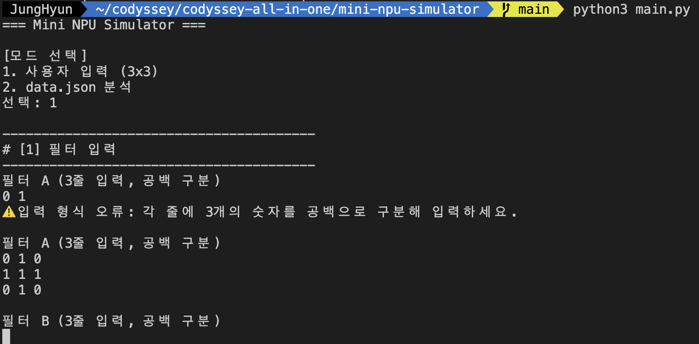
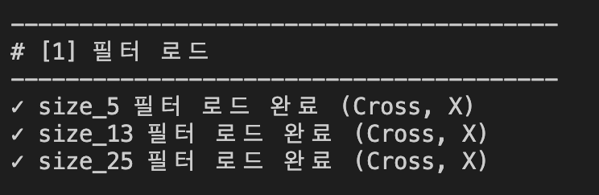
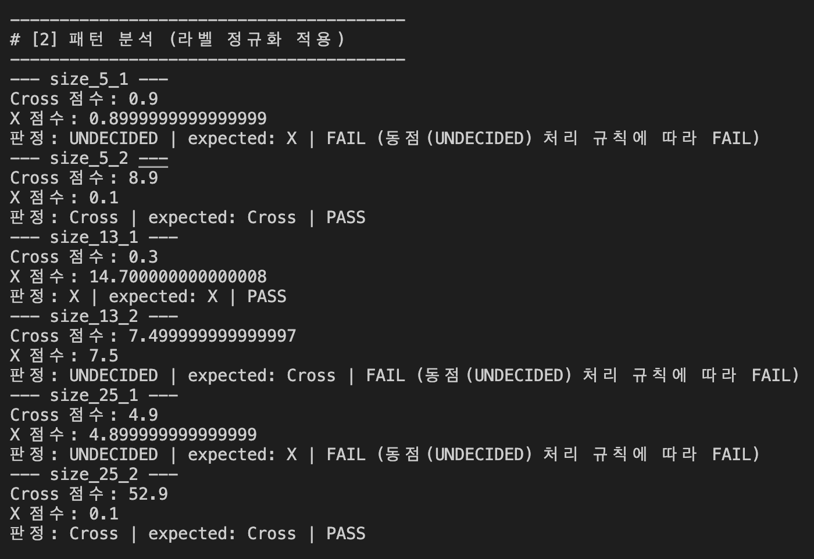
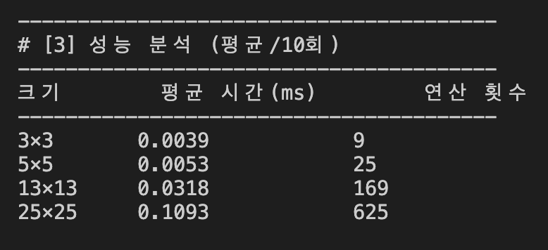
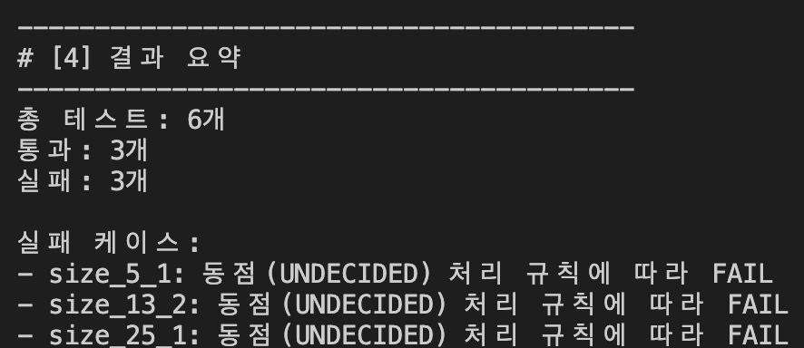

# 🧮 Mini NPU Simulator

MAC(Multiply-Accumulate) 연산의 핵심 원리를 직접 구현한 Python 콘솔 애플리케이션입니다. 3×3 사용자 입력과 5×5/13×13/25×25 `data.json` 배치 분석을 모두 지원하며, 외부 라이브러리(NumPy 등) 없이 표준 라이브러리만으로 작성했습니다.

## 실행 방법

```bash
python3 main.py
```

- `data.json`은 `main.py`와 같은 폴더(이 폴더의 루트)에 있어야 합니다.
- 실행 후 `[모드 선택]`에서 `1`(사용자 입력) 또는 `2`(data.json 분석)를 입력합니다.
- 모드 1에서는 필터 A, 필터 B, 패턴을 각각 3줄씩 공백으로 구분해 입력합니다 (예: `0 1 0`).

## 구현 요약

- **모듈 구성**: 역할별로 클래스를 나누고 파일도 그에 맞춰 분리했습니다. `main.py`는 모드를 선택해 실행하는 진입점만 담당하고, 실제 로직은 아래 "파일 구조"의 각 모듈에 있습니다.
- **데이터 구조**: `Grid` 클래스(`grid.py`)가 n×n 값을 저장하고 `get`/`set`으로 좌표 접근을 제공합니다. JSON에서 읽은 2차원 리스트도 `Grid.from_rows()`로 같은 자료구조에 담아 다룹니다.
- **MAC 연산**: `MacUnit.compute()`(`mac_unit.py`)가 반복문 두 겹으로 패턴과 필터를 같은 위치끼리 곱해 모두 더합니다. NumPy 등 벡터화 라이브러리는 사용하지 않았습니다.
- **라벨 정규화**: `LabelNormalizer`(`labels.py`)가 `expected`의 `'+'`/`'x'`뿐 아니라 필터 딕셔너리의 키(`cross`/`x`)도 같은 `normalize()`로 정규화해서 찾습니다(`find_filter()`). 그래서 필터 키의 대소문자가 달라도(`Cross`/`X` 등) 정상적으로 필터를 찾습니다.
- **동점(부동소수점) 처리 정책**: `Judge.decide()`(`judge.py`)가 `abs(score_a - score_b) < 1e-9`이면 `UNDECIDED`를 반환합니다. 점수가 다른 경로(단일 곱셈 vs 여러 번의 덧셈 누적)로 계산될 경우 수학적으로 같은 값이라도 이진 부동소수점 표현 때문에 마지막 자리에서 미세하게 어긋날 수 있기 때문입니다.
- **스키마 검증**: `PatternAnalyzer`(`pattern_analyzer.py`)가 각 패턴 키(`size_5_1` 등)를 `_`로 나눠 크기(N)를 추출하고(`get_pattern_size`, 정규식 없이 문자열 분리만 사용) 해당 `size_N` 필터를 찾습니다. 크기 불일치·필터 없음·라벨 인식 불가 등은 `analyze()`가 예외를 던지는 대신 결과 딕셔너리의 `reason`에 사유를 담아 케이스 단위 FAIL로 처리해서 프로그램 전체가 중단되지 않습니다.
- **필터 로드 상태 표시**: `size_5`/`size_13`/`size_25` 같은 최상위 키가 있는지뿐 아니라, 그 안에 `Cross`/`X`로 정규화되는 필터가 실제로 둘 다 존재하는지까지 `PatternAnalyzer.has_filter_pair()`로 확인한 뒤 `✓`를 출력합니다.
- **성능 분석**: `PerformanceBenchmark`(`performance.py`)가 크기별로 `PatternGenerator.cross(n)`(`pattern_generator.py`)을 직접 생성해 벤치마크합니다. MAC 연산 시간은 값의 내용이 아니라 크기(N)에만 영향을 받으므로, `data.json`에 해당 크기의 패턴이 있는지와 무관하게 항상 동일한 방식으로 3×3/5×5/13×13/25×25를 측정할 수 있습니다.
- **입출력/모드 실행**: `ConsoleIO`(`console_io.py`)가 입력 검증을, `Mode1App`/`Mode2App`(`modes.py`)이 각 모드의 흐름(입력 → 연산 → 판정 → 성능 분석 → 출력)을 담당합니다.

## 결과 리포트

### 실행 결과 (실제 `data.json` 기준)

```
총 테스트: 6개
통과: 3개
실패: 3개

실패 케이스:
- size_5_1  : 동점(UNDECIDED) 처리 규칙에 따라 FAIL
- size_13_2 : 동점(UNDECIDED) 처리 규칙에 따라 FAIL
- size_25_1 : 동점(UNDECIDED) 처리 규칙에 따라 FAIL
```

### 실패 원인 분석

3건 모두 **로직 문제가 아니라 부동소수점 표현 오차 때문에 의도적으로 발생하는 동점 판정**입니다. `data.json`의 필터를 보면 각 크기마다 한쪽 필터는 "활성 칸 중 하나가 큰 값 하나"로, 다른 쪽은 "활성 칸 여러 개가 작은 값 여러 개"로 설계되어 있습니다.

- **size_5_1** — 입력은 X자 패턴입니다. Cross 점수는 `1.0 × 0.9`(중앙 칸 한 번의 곱셈)로 정확히 `0.9`가 나오지만, X 점수는 `0.1`을 9번 더해서(`1.0×0.1`을 9개 칸에서 누적) 계산되는데 `0.1`은 이진수로 정확히 표현되지 않아 `0.8999999999999999`가 됩니다. 두 값의 차이(`≈1.1e-16`)는 `1e-9`보다 훨씬 작아 `UNDECIDED`로 판정되고, expected(`X`)와 다르므로 FAIL입니다.
- **size_25_1** — 원리는 size_5_1과 동일합니다. Cross 점수는 중앙 칸 `1.0 × 4.9` 한 번의 곱셈(`4.9`), X 점수는 `0.1`을 49번 누적한 값(`4.899999999999999`)이라 미세한 차이로 동점 처리됩니다.
- **size_13_2** — 반대 방향입니다. 이번엔 X 필터의 중앙 칸이 `7.5`(단일 값)이고 Cross 필터는 `0.3`을 25번 누적합니다. 입력은 십자가 패턴이라 Cross 점수는 `0.3×25`의 누적 합(`7.499999999999997`), X 점수는 중앙 한 칸의 `1.0×7.5`(`7.5`)로 계산되어 역시 `1e-9` 이내 차이로 `UNDECIDED`가 됩니다.

즉 세 케이스 모두 "패턴이 어느 필터와도 뚜렷하게 다르지 않아서"가 아니라, **정답이 하나로 확정되지 못하도록 필터 값 자체가 부동소수점 누적 오차를 유발하게 설계된 테스트 케이스**입니다. `1e-9` 허용오차 정책이 없었다면(예: `==` 비교) 두 값이 우연히 같을 때만 동점 처리되고 이런 케이스는 임의의 승자가 나와 오히려 잘못된 PASS/FAIL이 나올 수 있습니다 — epsilon 기반 비교가 반드시 필요한 이유입니다.

나머지 3건(size_5_2, size_13_1, size_25_2)은 점수 차이가 소수 단위 이상으로 커서(예: `8.9` vs `0.1`) 동점 판정 여지가 없고, 그대로 PASS했습니다.

### 성능 분석 (평균/10회, 실제 측정값)

| 크기(N×N) | 평균 시간(ms) | 연산 횟수(N²) |
| --- | --- | --- |
| 3×3 | 0.0009 | 9 |
| 5×5 | 0.0019 | 25 |
| 13×13 | 0.0103 | 169 |
| 25×25 | 0.0358 | 625 |

`compute_mac`은 N×N 칸을 한 번씩만 방문하는 이중 반복문이므로 시간 복잡도는 **O(N²)**입니다. 연산 횟수(N²)가 9→25→169→625로 늘어날 때 측정 시간도 대체로 같은 비율로 늘어납니다: 13×13→25×25 구간은 연산 횟수가 약 3.7배(625/169) 늘었고 측정 시간도 약 3.5배(0.0358/0.0103) 늘어 거의 일치합니다. 3×3→5×5 구간처럼 크기가 아주 작을 때는 반복문 자체보다 함수 호출·인터프리터 오버헤드의 비중이 커서 비율이 정확히 들어맞지 않지만, 크기가 커질수록 O(N²) 경향이 뚜렷해집니다. 실제 AI 모델의 필터가 훨씬 크고 개수도 많은 이유, 그리고 이를 병렬 처리하는 NPU가 필요한 이유가 여기서 나옵니다 — CPU의 단순 반복문으로는 N이 커질수록 처리 시간이 제곱으로 증가합니다.

## 기능 목록

- 모드 1: 3×3 필터 A/B, 패턴 입력 → MAC 점수/판정/연산 시간 출력
- 모드 2: `data.json` 로드 → 스키마 검증 → 케이스별 판정(PASS/FAIL) → 성능 분석 → 결과 요약
- 라벨 정규화(`+`/`cross` → `Cross`, `x` → `X`)
- 허용오차(`1e-9`) 기반 동점 처리
- 입력 검증: 행/열 개수 불일치, 숫자 파싱 실패 시 안내 후 재입력
- data.json 누락/손상, 필터-패턴 크기 불일치 시에도 프로그램이 중단되지 않고 케이스 단위로 처리

## 기능 검증 스크린샷

아래 8개 항목은 평가 문항(기능 동작 검증)과 1:1로 매칭됩니다. 각 항목의 "재현 방법"대로 `python3 main.py`를 실행해서 나온 화면을 캡처한 뒤, `screenshots/` 폴더에 표시된 파일명으로 저장하면 아래 이미지가 자동으로 채워집니다. **4~8번은 모드 2를 한 번 실행한 화면 안에 전부 들어있으므로, 스크롤해서 구간별로 나눠 캡처하거나 스크린샷 하나로 여러 항목을 겹쳐 써도 됩니다.**

| # | 확인 항목 | 재현 방법 |
| --- | --- | --- |
| 1 | 모드 1: 3×3 필터 2개 + 패턴 입력 → MAC 점수/판정/시간 출력 | 모드 `1` 선택 → 필터 A `0 1 0`/`1 1 1`/`0 1 0`, 필터 B `1 0 1`/`0 1 0`/`1 0 1`, 패턴 `1 0 1`/`0 1 0`/`1 0 1` 입력 → `[3] MAC 결과` 구간 캡처 |
| 2 | 모드 1: 허용오차 내 동점 시 "판정 불가" 출력 | 모드 `1` 선택 → 필터 A와 필터 B에 **완전히 같은 3×3 값**(예: `1 0 0`/`0 1 0`/`0 0 1`)을 입력 → `판정: 판정 불가 (|A-B| < 1e-9)` 줄 캡처 |
| 3 | 모드 1: 행/열 개수 불일치·파싱 실패 시 오류 안내 후 재입력 | 모드 `1` 선택 → 필터 A 첫 줄에 숫자 2개만(`0 1`) 입력 → `⚠️ 입력 형식 오류...` 메시지와 재입력 프롬프트가 함께 보이는 화면 캡처 |
| 4 | 모드 2: filters/patterns 로드, 패턴 키에서 N 추출 후 올바른 필터 선택 | 모드 `2` 선택 → `# [1] 필터 로드`와 `# [2] 패턴 분석` 구간(6개 케이스 전부) 캡처 |
| 5 | expected/필터 키가 표준 라벨(Cross/X)로 정규화되어 비교됨 | 위와 동일한 모드 2 실행 화면에서 각 케이스의 `판정: ... | expected: Cross/X | PASS`류 출력이 보이도록 캡처 |
| 6 | 모드 2: 허용오차 내 동점 시 "UNDECIDED" 출력 및 FAIL 집계 | 위와 동일한 화면에서 `size_5_1`, `size_13_2`, `size_25_1`의 `UNDECIDED ... FAIL` 줄이 보이도록 캡처 |
| 7 | 성능 분석 표에 크기/평균 시간/연산 횟수 출력 | `# [3] 성능 분석` 표(3×3/5×5/13×13/25×25) 구간 캡처 |
| 8 | 콘솔에 총 테스트/통과/실패 및 실패 케이스 요약 출력 | `# [4] 결과 요약`(총 테스트/통과/실패 + 실패 케이스 목록) 구간 캡처 |

| 항목 | 스크린샷 |
| --- | --- |
| 1. 모드 1 기본 동작 |  |
| 2. 모드 1 판정 불가 |  |
| 3. 모드 1 입력 검증 |  |
| 4. 모드 2 필터/패턴 매칭 |  |
| 5. 라벨 정규화 |  |
| 6. 모드 2 UNDECIDED/FAIL |  |
| 7. 성능 분석 표 |  |
| 8. 결과 요약 |  |

> 이미지 파일을 아직 넣기 전에는 위 표가 깨진 이미지 아이콘으로 보입니다 — `screenshots/` 폴더에 같은 파일명으로 캡처본을 추가하면 정상적으로 표시됩니다.

## 코드 구조 · 기술 원리 Q&A

평가 문항의 "설명할 수 있는가?" 항목(10~19번)에 대한 답변입니다. 10~13번은 코드 구조/설계, 14~17번은 핵심 기술 원리, 18~19번은 심층 인터뷰(확장 시나리오) 질문입니다.

**10. MAC 연산 로직의 전체 흐름을 코드 구조 기준으로 설명할 수 있는가?**

입력이 어디서 오든 결국 `Grid`라는 객체 하나로 통일되게 만들었습니다. 콘솔에서 받은 값도, JSON에서 읽은 값도 `Grid`로 바뀌고 나면 그다음부터는 연산을 담당하는 부분이 값이 어디서 왔는지 신경 쓸 필요가 없습니다. 그 연산 부분(`MacUnit.compute()`) 안에서는 행이랑 열을 이중 반복문으로 돌면서, 같은 위치에 있는 두 값을 곱하고 결과를 하나의 변수에 바로바로 더해나가다가 마지막에 그 값을 점수로 돌려줍니다. 그러니까 흐름은 자료구조를 통일하는 단계 → 순수하게 연산만 하는 단계 → 값을 반환하는 단계, 이렇게 세 단계로 나눠서 짰다고 보면 됩니다.

**11. patterns 키에서 크기 N을 추출하고 매칭하는 로직은 어떻게 설계했는가?**

패턴 키에서 크기를 뽑아낼 때는 언더바로 문자열을 쪼갰습니다. 예를 들어 `size_5_1`이라는 키가 들어오면 `size`, `5`, `1` 이렇게 세 조각이 나오는데, 첫 조각이 `size`이고 두 번째 조각이 숫자면 그 숫자를 크기로 씁니다(`PatternAnalyzer.get_pattern_size()`). 정규식을 쓸 수도 있었지만 굳이 안 쓰고 이렇게 단순하게 짠 이유는, 코드를 읽는 사람이 정규식 문법을 몰라도 바로 이해할 수 있게 하고 싶어서였습니다. 이렇게 뽑은 크기로 필터 키를 만들어서 찾아가는데, 그 크기의 필터가 없거나 패턴 크기가 안 맞으면 예외를 던지지 않고 그 케이스만 실패 처리하고 다음 케이스로 넘어가게 했습니다. 하나가 잘못됐다고 프로그램 전체가 멈추면 안 된다는 요구사항이 있었기 때문입니다.

**12. 라벨 정규화를 별도 함수/모듈로 분리한 이유와 장점을 설명할 수 있는가?**

표준 라벨로 바꿔야 하는 곳이 두 군데였습니다. 정답 값(`expected`), 그리고 필터 딕셔너리의 키. 이걸 각자 따로 처리하면 데이터를 다듬는 전처리 로직과 실제 판정하는 비즈니스 로직이 뒤섞여서 결합도가 높아지고, 나중에 규칙이 하나 바뀌었을 때 두 곳을 다 고쳐야 하는 문제가 생깁니다. 그래서 정규화 로직을 `LabelNormalizer`라는 별도 클래스(`labels.py`)로 완전히 떼어냈고, 정답 값을 정규화할 때랑 필터 키를 찾을 때 똑같은 함수(`normalize()`)를 재사용하게 만들었습니다. 실제로 이렇게 분리해 놓은 덕분에, 필터 키가 대문자로 들어오는 경우를 나중에 발견했을 때도 그 함수 하나만 고치면 전체가 다 고쳐지는 걸 확인했습니다. 라벨이 나중에 더 늘어나도 이 클래스 하나만 확장하면 되니까, 결합도는 낮추고 확장성은 열어두는 구조입니다.

**13. 시간 측정 시 I/O를 배제하고 "연산 구간"을 측정하기 위해 어떤 경계를 잡았는가?**

성능을 잴 때 타이머 안에는 순수하게 연산 함수 호출 하나만 들어가게 했습니다. `perf_counter`를 연산 함수(`MacUnit.compute`) 바로 앞뒤에 붙여서, 사용자 입력 모드에서는 입력을 다 받은 다음에 타이머를 시작하고 MAC 연산만 열 번 돌린 다음 타이머를 멈춥니다. 화면에 출력하는 부분은 타이머 바깥에 있습니다. `data.json`을 분석하는 모드의 성능 표는 아예 파일을 다시 읽지 않고 그 자리에서 패턴을 직접 만들어서 재는 방식으로 짜서(`PerformanceBenchmark.benchmark_sizes()`), 파일 읽는 시간이 측정 구간에 섞일 일이 아예 없게 만들었습니다.

**14. MAC 점수가 높을수록 "더 유사하다"고 판단할 수 있는 이유는?**

필터에서 값이 큰 칸, 즉 활성화된 칸이랑 입력 패턴에서 값이 큰 칸이 같은 자리에 있어야만 곱한 값이 커집니다. 둘 중 하나라도 0이면 그 자리는 계산에서 사실상 없는 셈이 됩니다. 위치가 겹칠수록 곱셈 결과가 그대로 보존돼서 점수에 쌓이는 구조라서, 점수는 결국 필터가 표시해둔 자리들이 입력에서도 실제로 켜져 있었는지를 세는 값이 됩니다. 그 값이 클수록 두 격자가 같은 자리에서 겹친다는 뜻이니까 더 닮았다고 볼 수 있는 것입니다.

**15. 연산 횟수가 N²로 증가하며 O(N²) 경향을 보이는 이유는?**

MAC 연산은 가로 세로 N칸짜리 격자를 한 칸도 안 빼놓고 딱 한 번씩만 보기 때문에, 곱셈이랑 덧셈이 정확히 N의 제곱 번 일어납니다. 그래서 N이 5배 커지면 연산 횟수는 25배로 폭증합니다. 실제로 측정해봐도 13×13에서 25×25로 넘어갈 때 연산 횟수는 약 3.7배(625/169) 늘어나는데 걸리는 시간도 거의 비슷하게 약 3.5배(0.0358ms/0.0103ms) 늘어나서, 이론과 실제 측정이 거의 맞아떨어지는 걸 확인했습니다.

**16. 부동소수점 오차는 왜 생기고, 허용오차 정책은 왜 필요한가?**

컴퓨터는 소수를 2진 분수로 저장하다 보니, 10진수로는 딱 떨어지는 `0.1` 같은 숫자도 2진수로는 끝없이 반복되는 값이 돼서 어딘가에서 절삭됩니다. 그래서 `0.1`을 아홉 번 더한 값과 `1.0`에 `0.9`를 한 번 곱한 값이 수학적으로는 똑같이 `0.9`여야 하는데, 실제로는 마지막 자리에서 미세하게 달라집니다(`0.8999999999999999`). 이걸 그냥 같다/다르다로 비교해버리면 계산 순서에 따라 승자가 바뀌어버리기 때문에, 두 점수의 차이가 `1e-9`보다 작으면 같은 값으로 봐주는 허용오차 비교 정책(`Judge.decide()`)을 넣었습니다.

**17. 동점 처리 규칙을 mode1 vs mode2로 다르게 둔 이유를 요구사항 관점에서 설명할 수 있는가?**

사실 동점을 판단하는 규칙 자체는 두 모드가 완전히 같습니다. 판정 함수(`Judge.decide()`) 하나를 모드 1과 모드 2에서 그대로 재사용합니다. 모드 1은 그 자리에서 입력한 두 필터를 비교하는 것이라 비교할 정답이 애초에 없어서, 동점이면 그냥 "판정 불가"라고 알려주면 끝입니다. 반면 모드 2는 정답과 자동으로 비교해서 통과/실패를 집계하는 배치 테스트라서, 동점을 나타내는 값이 정답으로 쓰이는 `Cross`나 `X`와 절대 겹치면 안 됩니다. 만약 겹친다면 사실은 애매한 판정인데 우연히 정답과 같아져서 통과로 잘못 집계되는, 일종의 거짓 양성(False Positive)이 생길 수 있기 때문입니다. 그래서 `UNDECIDED`라는 별도의 값을 써서 동점 케이스가 항상 예외 없이 실패로 집계되게 만들었고, 이것이 판정 결과의 신뢰성을 지키는 안전장치 역할을 합니다.

**18. data.json에 새로운 라벨이 추가된다면, 확장할 순서를 설명할 수 있는가?**

먼저 데이터 쪽부터 늘립니다 — `LabelNormalizer`에 새 표준 라벨과 매핑 규칙을 추가합니다. 그다음 파서를 확장해서, 지금 점수 두 개만 비교하게 되어 있는 판정 로직(`Judge.decide()`)을 라벨과 점수를 짝지어 받는 형태로 바꾸고 1등, 2등 점수 차이로 동점을 판단하도록 일반화합니다. 마지막으로 로직을 리팩토링해서 출력 부분이 라벨 개수만큼 반복되게 고치고, 새 라벨이 섞인 테스트 케이스로 통과/실패 집계가 맞는지 확인합니다. **데이터 확장 → 파서 확장 → 로직 리팩토링** 이 순서로 가는 이유는, 가장 위험한 판정 로직을 먼저 안전하게 만들어놓고 나머지를 그 위에 얹는 게 맞다고 판단했기 때문입니다.

**19. 대규모 패턴 처리 시 문제점과 최적화 방안, CPU/NPU 병목을 설명할 수 있는가?**

연산 횟수가 정확히 크기의 제곱이므로, 25×25 대비 1000×1000은 연산 횟수가 약 1,600배로 늘어납니다. 25×25 평균 시간(0.0358ms)에 비례시켜보면 한 번 연산에 대략 50~60ms 정도로 추정되고, 필터나 패턴이 여러 개면 수십 초에서 몇 분까지 늘어날 수 있습니다. 메모리도 비슷한데, 격자를 파이썬 리스트로 저장하다 보니 백만 개짜리 격자 하나에 수십 MB 정도 들어가고, 필터를 수백×수백 크기로 수천 개 쓴다면 GB 단위로 쌓일 수 있습니다. 근본 원인은 지금 코드가 파이썬 반복문으로 한 칸씩 순차 처리하는 **단일 스레드 구조**라는 데 있습니다 — 각 칸의 곱셈은 서로 완전히 독립적인데도 줄을 세워 하나씩 처리하니까 병목이 연산 유닛의 초당 처리량에 생깁니다. 우선순위를 매긴다면 먼저 2차원 리스트를 1차원으로 펴서(flattening) 인덱싱 오버헤드부터 줄이고, 근본적으로는 NPU처럼 곱셈-누적 유닛을 수백, 수천 개 동시에 배치해서 병렬로 처리해야 이 병목이 풀립니다. 다만 그렇게 되면 병목이 그 많은 유닛에 데이터를 실어 나르는 메모리 대역폭과, 부분합을 다시 하나로 합치는 마지막 리덕션 단계로 옮겨갈 뿐입니다.

## 파일 구조

역할별 클래스를 파일 단위로 나눴습니다. `main.py`는 모드 선택 후 `Mode1App`/`Mode2App`을 실행하는 진입점만 담당합니다.

```
mini-npu-simulator/
├── main.py              # 진입점: 모드 선택 → Mode1App/Mode2App 실행
├── grid.py              # Grid: n×n 데이터 저장/조회 자료구조
├── pattern_generator.py # PatternGenerator: Cross/X 패턴 자동 생성 (성능 측정용)
├── mac_unit.py          # MacUnit: MAC(Multiply-Accumulate) 연산
├── labels.py            # LabelNormalizer: expected/필터 키 라벨 정규화
├── judge.py             # Judge: epsilon 기반 점수 비교/판정
├── performance.py       # PerformanceBenchmark: 반복 측정 및 크기별 벤치마크
├── pattern_analyzer.py  # PatternAnalyzer: data.json 로드, 스키마 검증, 패턴별 분석
├── console_io.py        # ConsoleIO: 콘솔 입력 검증/읽기
├── modes.py             # Mode1App/Mode2App: 모드별 실행 흐름과 출력
├── data.json             # 필터(5×5/13×13/25×25)와 패턴 데이터
├── screenshots/          # 기능 검증 스크린샷 (README "기능 검증 스크린샷" 섹션에서 참조)
└── README.md             # 이 문서
```
